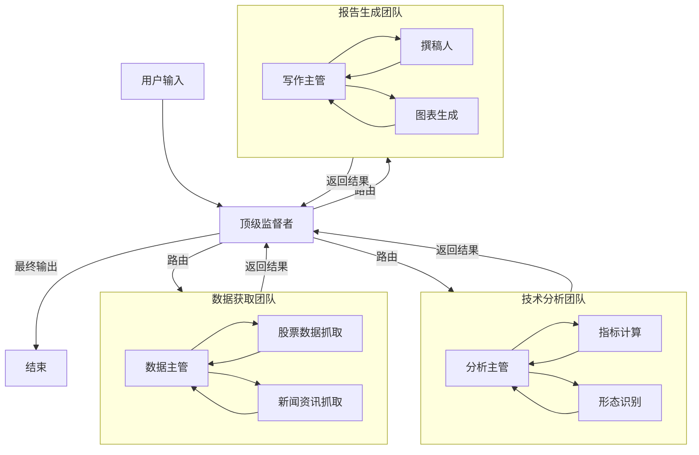

# 🏗️ LangGraph Hierarchical Agent Teams Architecture

> 基于 LangGraph 的分层多智能体系统架构设计参考

## 1. 核心概念 (Core Concepts)

分层代理团队（Hierarchical Agent Teams）是一种高级的多智能体编排模式，通过引入"监督者"（Supervisor）节点来管理和路由任务，形成树状或网状的组织结构。

### 1.1 架构组件

- **Supervisor (监督者)**: 
  - 负责高层规划和任务分配。
  - 不直接执行具体工作，而是将任务路由给下级团队或特定 Worker。
  - 类似于公司的"经理"角色。

- **Teams (团队/子图)**:
  - 专注特定领域的子系统（如"数据研究团队"、"文档写作团队"）。
  - 每个团队可以有自己的内部监督者和工作流。
  - 在 LangGraph 中表现为嵌套的 `StateGraph`。

- **Workers (执行者)**:
  - 具体的 Agent，拥有特定的工具（Tools）。
  - 负责执行原子任务（如"搜索网页"、"生成图表"）。

- **Global State (全局状态)**:
  - 在整个图谱中流转的共享上下文（主要是消息历史）。

## 2. 架构图示 (Architecture Diagram)



## 3. 在金融分析助手中的应用

### 3.1 角色分配

| 团队/角色 | 职责 | 工具 (Skills) |
| :--- | :--- | :--- |
| **Top Supervisor** | 理解用户意图，协调各团队 | 无 (纯路由) |
| **Data Team** | 获取原始市场数据 | `fetch_stock_daily`, `fetch_news`, `get_fundamentals` |
| **Analysis Team** | 计算指标，进行量化分析 | `calculate_macd`, `calculate_rsi`, `detect_trend` |
| **Visualization Team** | 生成可视化图表 | `plot_kline`, `plot_correlation` |
| **Reporting Team** | 综合信息，撰写研报 | `write_report`, `format_markdown` |

### 3.2 优势

1.  **关注点分离**: 每个 Agent 只需关注有限的上下文和工具，减少幻觉。
2.  **可扩展性**: 添加新功能只需增加新的 Worker 或 Team，不影响现有逻辑。
3.  **复杂任务处理**: 能处理"先获取数据，再分析，最后写报告"这种长链条任务。

## 4. 实现代码片段 (参考)

```python
from langgraph.graph import StateGraph, END
from langchain_core.messages import HumanMessage

# 1. 定义监督者节点
def supervisor_node(state):
    # 使用 LLM 决定下一步路由给哪个团队
    next_team = llm_router.invoke(state["messages"])
    return {"next": next_team}

# 2. 定义子图 (Team)
data_team_builder = StateGraph(TeamState)
data_team_builder.add_node("fetcher", fetcher_agent)
data_team_builder.add_node("cleaner", cleaner_agent)
# ... 构建子图 ...
data_team_graph = data_team_builder.compile()

# 3. 构建主图
super_builder = StateGraph(GlobalState)
super_builder.add_node("supervisor", supervisor_node)
super_builder.add_node("data_team", data_team_graph)
super_builder.add_node("analysis_team", analysis_team_graph)

super_builder.add_edge("supervisor", "data_team")
# ... 定义边 ...

app = super_builder.compile()
```

## 5. 总结

LangGraph 的 Deep Agent / Hierarchical 模式非常适合**复杂、多步骤、需要专业分工**的金融分析场景。它通过层级化管理，解决了单一 Agent 上下文过长和工具过多的问题。
